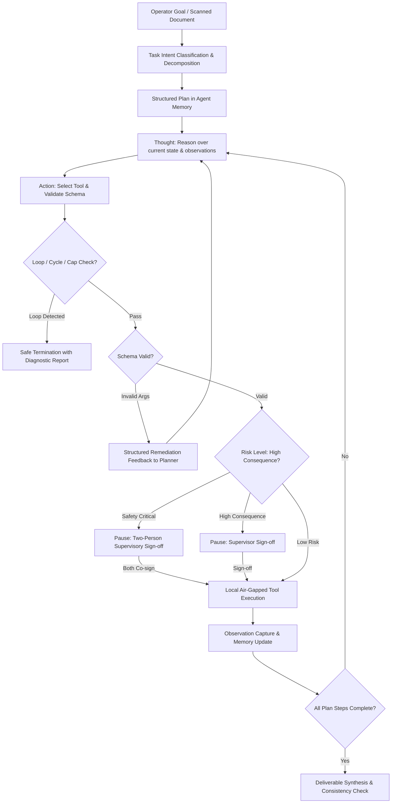

# P1 Architectural Brief & Judge Defense Narrative
## Sovereign On-Premise Agentic AI Workbench (MRPL Smart Automation — SIH26117)

**Author:** P1 — Agent Architecture Lead (Team Lead)  
**Sponsor:** Mangalore Refinery and Petrochemicals Limited (MRPL)  
**Core Proof Point:** Fully air-gapped, on-premise, multi-model agentic system with provable zero-exfiltration and graceful degradation under hardware constraints.

---

## 1. Executive Summary & Core Judge Question

### *Judge Question: "How does this architecture scale to new open-weight models as AI evolves?"*

> **The P1 Architectural Answer:**  
> In conventional LLM demos, model calls are tightly coupled to specific SDKs or hardcoded prompt formats. If a new state-of-the-art model is released (e.g., DeepSeek-V3 or a new Qwen variant), conventional codebases require extensive refactoring of prompting logic, parameter parsers, and tool invocation wrappers.
>
> In our **Sovereign Workbench**, we engineered a strictly decoupled **Three-Tier Architecture**:
> 1. **Declarative Model Registry (`model_router/model_registry.yaml`)**: Every model's capabilities (`reasoning`, `code`, `vision`, `summarization`), context window limits, quantization profile, and fallback chain are defined as declarative configuration. Adding a newly released model requires **zero lines of Python code**—only a 10-line YAML entry.
> 2. **Standardized Adapter Contract (`model_router/adapters/base.py`)**: All inference engines (vLLM, Ollama, llama.cpp, SGLang) implement a uniform `ModelAdapter` interface (`generate`, `generate_chat`, `health_check`).
> 3. **Hardware-Aware Router & Fallback Policy (`model_router/router.py` & `fallback_policy.py`)**: The router dynamically selects models based on task intent and active GPU resources, automatically cascading down fallback chains if a high-parameter model suffers an Out-Of-Memory (OOM) or timeout condition.

---

## 2. ReAct Plan-Execute Loop vs. Single-Turn Chat

### Why Chatbots Fail in Refinery Operations
Refinery troubleshooting cannot be solved by single-turn prompt-response chat:
- Real refinery tasks are multi-modal and multi-step: an operator needs to extract data from a scanned pump log sheet, look up safety thresholds in an internal standard operating procedure (SOP), calculate variance, and draft a formal approval note.
- If a one-shot model hallucinates or miscalculates a threshold, an unvalidated response is presented to the operator as fact.

### The Sovereign ReAct Plan-Execute Engine
Our agent implements a deterministic **ReAct (Reasoning + Acting)** execution cycle:


1. **Decomposition**: The agent parses the user's objective into discrete sub-goals tracked in stateful `AgentMemory`.
2. **Step-by-Step Reason & Act**: Each step produces a visible `Thought`, an `Action` with strictly typed JSON parameters, and an `Observation` recorded into working memory.
3. **Observation-Driven Self-Correction**: If a tool returns an error or unexpected reading (e.g. vibration > 6.0 mm/s), the agent observes the result and adapts its next action rather than blindly pushing forward.

---

## 3. Industrial Safety: Loop Detection & Human-in-the-Loop Approval Gate

In mission-critical industrial plants like MRPL, an uncontrolled agent loop or autonomous destructive action can lead to plant downtime or safety violations:

### A. Cycle & Loop Detection (`agent_core/loop_detector.py`)
- **Exact Tool-Argument Hash Tracking**: We hash the tuple `(tool_name, deterministic_json(args))`. If an agent attempts the exact same tool call 3 times consecutively (indicating a stagnation loop), execution halts immediately.
- **Cycle Detection**: The loop detector maintains a sliding history and detects 2-step (`A -> B -> A -> B`) and 3-step (`A -> B -> C -> A -> B -> C`) oscillating cycles.
- **Hard Iteration Capping**: Default limit of 15 iterations prevents token runaway and thread exhaustion.

### B. Role-Based Access Control (RBAC) & Two-Person Rule (`auth/rbac.py` & `agent_core/approval_gate.py`)
Refinery operations require strict separation of concerns across operational roles:
- **OPERATOR (`op_rajesh`)**: Ingests field logs, queries SOP manuals, triggers agent workflows. Cannot authorize high-consequence actions.
- **ENGINEER (`eng_priya`)**: Evaluates diagnostic telemetry, executes sandbox simulations, reviews maintenance proposals.
- **SUPERVISOR (`sup_anand`, `sup_mehta`)**: Full authorization authority.
- **Two-Person Supervisory Gate for Safety-Critical Tasks**: Actions involving emergency shutdowns, unit trips, or flare isolations require co-signatures from **two distinct supervisors**. Duplicate sign-offs by the same user are blocked by gate constraints.

---

## 4. High Availability & Resilience: The Fallback Policy

### The Reality of On-Premise GPU Deployments
At refinery sites or hackathon venues, GPU hardware is frequently constrained (e.g. 16GB–24GB VRAM instead of full 80GB A100 clusters). When a 72B parameter model experiences concurrent batch load or long-context spikes, CUDA Out-Of-Memory (OOM) errors occur.

### Our Solution: Cascading Degradation
The `FallbackPolicy` guarantees high availability without crashing:
```
Priority 1: Qwen2.5-72B-Instruct (High Precision Reasoning)
     ↓ [On OOM / Process Crash / Timeout]
Priority 2: Qwen2.5-32B-Instruct (Balanced Quantized Model)
     ↓ [On Secondary OOM]
Priority 3: Qwen2.5-14B-Instruct (Guaranteed Lightweight Fallback)
```
- **Live Audit Telemetry**: Every failover event generates a tamper-evident audit record (`FallbackEvent`) documenting the original model, target model, triggering exception, and timestamp.
- **Judge Defense Value**: Instead of pretending hardware limits don't exist, we demonstrate intentional engineering for resilience: *"The system degrades gracefully, it does not crash."*

---

## 5. v4 Architectural Improvisations Delivered

### A. Schema-Constrained Tool Calling (`agent_core/schema_validator.py`)
- Automatically validates tool parameters against registered Pydantic models or Python type signatures before dispatch.
- Intercepts invalid parameters and provides structured remediation feedback to the ReAct loop for autonomous self-correction.

### B. Explainability Layer (`agent_core/explainability.py`)
- Converts dense agent scratchpads into human-understandable **"One-Line Decision Rationales"** and structured `DecisionCards`.
- Every card grounds the action in evidence (SOP rules or inspection telemetry), ready for UI dashboards and audit reviewers.

### C. Cross-Model Consistency Check (`agent_core/consistency_check.py`)
- Dispatches identical diagnostic context to two independent local models (e.g., `qwen2.5-72b-instruct` and `qwen2.5-32b-instruct`).
- Evaluates agreement on numerical thresholds and shutdown recommendations. Disagreements automatically flag the ticket for supervisory review instead of hallucinating consensus.

### D. Multi-Agent Specialization [Stretch] (`agent_core/multi_agent/sub_agents.py`)
- Modularizes the planner into three cooperating agents:
  1. `ExtractionAgent`: Parses raw logs and OCR telemetry into typed data structures.
  2. `DraftingAgent`: Composes formal refinery maintenance approval notes.
  3. `VerificationAgent`: Adversarially cross-checks every numerical claim and threshold against raw extraction data to eliminate hallucinations before human review.

### E. Retrieval-Augmented Tool Selection [Stretch] (`agent_core/trace_tool_selector.py`)
- Indexes successful task execution traces from the tamper-evident audit log.
- Recommends proven tool sequences as few-shot exemplars when planning new tasks.

---

## 6. Team Contract & Cross-Cutting Interfaces

As Lead Architect (P1), the subsystem interfaces are locked and documented for the entire team:

| Team Member | Interface Contract with P1 | Delivery State |
|---|---|---|
| **P2 (Model Infra)** | Implements `ModelAdapter` for vLLM / Ollama backends matching `model_registry.yaml` IDs; supplies secondary model for Cross-Model Consistency. | Verified with `MockLocalAdapter` & dual-inference tests. |
| **P3 (Multimodal/OCR)** | Exposes OCR output contract `read_scanned_ocr_text` and VLM visual inspection tools. | Compatible with ToolExecutor and ExtractionAgent. |
| **P4 (Tools & Sandbox)** | Registers sandboxed file I/O, python-docx/openpyxl generators via `ToolExecutor.register_tool` with Pydantic schemas. | Schema-constrained validation & RBAC gate pre-configured for P4's file-write operations. |
| **P5 (KB & Frontend)** | Consumes Decision Cards, One-Line Rationales, and pending Approval Requests via structured event streams. | Data models (`DecisionCard`, `ApprovalRequest`) finalized. |
| **P6 (Security & Audit)** | Consumes `FallbackEvent`, `ToolInvocation`, `ApprovalSignOff`, and `ConsistencyReport` into append-only audit log. | Complete audit event payloads provided. |

---

## 7. Verification Summary

All P1 modules are fully covered by automated regression suites and interactive demonstration runners:
- **25 Unit Tests Passing (100% Pass Rate)** (`tests/test_model_router.py`, `tests/test_fallback.py`, `tests/test_agent_core.py`, `tests/test_v4_p1_features.py`)
- **Two Interactive Demonstrations**:
  1. `python run_p1_demo.py`: Validates routing, OOM fallback, loop protection, and baseline ReAct loop.
  2. `python run_p1_v4_demo.py`: Validates schema enforcement, explainability rationales, dual-model consensus checking, RBAC two-person gate, multi-agent verification, and trace-based tool selection.
